# Diagrama de Clases UML - Gestor de Academias

## Descripción General
Este diagrama representa la arquitectura del sistema de Gestión de Academias siguiendo el patrón MVC (Model-View-Controller) con una capa de servicios. Se muestran las principales clases, sus atributos, métodos y las relaciones entre ellas.

---

## Arquitectura del Sistema

El sistema está organizado en las siguientes capas:

1. **Model (Modelo)** - Entidades JPA que representan la base de datos
2. **Repository (Repositorio)** - Interfaces de acceso a datos (Spring Data JPA)
3. **Service (Servicio)** - Lógica de negocio
4. **Controller (Controlador)** - Endpoints y gestión de peticiones
5. **Config (Configuración)** - Configuración de seguridad, CORS, conversores
6. **DTO (Data Transfer Objects)** - Objetos de transferencia de datos
7. **Exception (Excepciones)** - Manejo de excepciones personalizadas
8. **Util (Utilidades)** - Clases auxiliares

---

## 1. CAPA DE MODELO (Model)

### 1.1 Entidades Principales

#### Academia
```java
@Entity
@Table(name = "academia")
public class Academia {
    - id: Long
    - nombre: String
    - activa: Boolean
    - fechaAlta: LocalDateTime
    - nifCif: String
    - emailContacto: String
    - telefono: String
    - direccion: String
    
    + Academia()
    + getId(): Long
    + setId(id: Long): void
    + getNombre(): String
    + setNombre(nombre: String): void
    + getActiva(): Boolean
    + setActiva(activa: Boolean): void
    + getFechaAlta(): LocalDateTime
    + setFechaAlta(fechaAlta: LocalDateTime): void
    + getNifCif(): String
    + setNifCif(nifCif: String): void
    + getEmailContacto(): String
    + setEmailContacto(emailContacto: String): void
    + getTelefono(): String
    + setTelefono(telefono: String): void
    + getDireccion(): String
    + setDireccion(direccion: String): void
}
```

#### Usuario
```java
@Entity
@Table(name = "usuario")
public class Usuario {
    - id: Long
    - username: String
    - password: String
    - email: String
    - nombre: String
    - apellidos: String
    - rol: Rol
    - activo: Boolean
    - emailVerificado: Boolean
    - academia: Academia
    
    + Usuario()
    + getId(): Long
    + setId(id: Long): void
    + getUsername(): String
    + setUsername(username: String): void
    + getPassword(): String
    + setPassword(password: String): void
    + getEmail(): String
    + setEmail(email: String): void
    + getNombre(): String
    + setNombre(nombre: String): void
    + getApellidos(): String
    + setApellidos(apellidos: String): void
    + getRol(): Rol
    + setRol(rol: Rol): void
    + getActivo(): Boolean
    + setActivo(activo: Boolean): void
    + getEmailVerificado(): Boolean
    + setEmailVerificado(emailVerificado: Boolean): void
    + getAcademia(): Academia
    + setAcademia(academia: Academia): void
}
```

#### Profesor
```java
@Entity
@Table(name = "profesor")
public class Profesor {
    - id: Long
    - usuario: Usuario
    - academia: Academia
    - especialidad: String
    - biografia: String
    - fechaContratacion: LocalDate
    
    + Profesor()
    + getId(): Long
    + setId(id: Long): void
    + getUsuario(): Usuario
    + setUsuario(usuario: Usuario): void
    + getAcademia(): Academia
    + setAcademia(academia: Academia): void
    + getEspecialidad(): String
    + setEspecialidad(especialidad: String): void
    + getBiografia(): String
    + setBiografia(biografia: String): void
    + getFechaContratacion(): LocalDate
    + setFechaContratacion(fechaContratacion: LocalDate): void
}
```

#### Alumno
```java
@Entity
@Table(name = "alumno")
public class Alumno {
    - id: Long
    - usuario: Usuario
    - academia: Academia
    - fechaRegistro: LocalDate
    - estadoMatricula: String
    - observaciones: String
    
    + Alumno()
    + getId(): Long
    + setId(id: Long): void
    + getUsuario(): Usuario
    + setUsuario(usuario: Usuario): void
    + getAcademia(): Academia
    + setAcademia(academia: Academia): void
    + getFechaRegistro(): LocalDate
    + setFechaRegistro(fechaRegistro: LocalDate): void
    + getEstadoMatricula(): String
    + setEstadoMatricula(estadoMatricula: String): void
    + getObservaciones(): String
    + setObservaciones(observaciones: String): void
}
```

#### Curso
```java
@Entity
@Table(name = "curso")
public class Curso {
    - id: Long
    - academia: Academia
    - nombre: String
    - descripcion: String
    - duracionHoras: Integer
    - precio: BigDecimal
    - fechaInicio: LocalDate
    - fechaFin: LocalDate
    - categoria: String
    - profesor: Profesor
    - plazasDisponibles: Integer
    - activo: Boolean
    
    + Curso()
    + getId(): Long
    + setId(id: Long): void
    + getAcademia(): Academia
    + setAcademia(academia: Academia): void
    + getNombre(): String
    + setNombre(nombre: String): void
    + getDescripcion(): String
    + setDescripcion(descripcion: String): void
    + getDuracionHoras(): Integer
    + setDuracionHoras(duracionHoras: Integer): void
    + getPrecio(): BigDecimal
    + setPrecio(precio: BigDecimal): void
    + getFechaInicio(): LocalDate
    + setFechaInicio(fechaInicio: LocalDate): void
    + getFechaFin(): LocalDate
    + setFechaFin(fechaFin: LocalDate): void
    + getCategoria(): String
    + setCategoria(categoria: String): void
    + getProfesor(): Profesor
    + setProfesor(profesor: Profesor): void
    + getPlazasDisponibles(): Integer
    + setPlazasDisponibles(plazasDisponibles: Integer): void
    + getActivo(): Boolean
    + setActivo(activo: Boolean): void
}
```

#### Aula
```java
@Entity
@Table(name = "aula")
public class Aula {
    - id: Long
    - academia: Academia
    - nombre: String
    - capacidad: Integer
    - activa: Boolean
    - recursos: String
    
    + Aula()
    + getId(): Long
    + setId(id: Long): void
    + getAcademia(): Academia
    + setAcademia(academia: Academia): void
    + getNombre(): String
    + setNombre(nombre: String): void
    + getCapacidad(): Integer
    + setCapacidad(capacidad: Integer): void
    + getActiva(): Boolean
    + setActiva(activa: Boolean): void
    + getRecursos(): String
    + setRecursos(recursos: String): void
}
```

#### Matricula
```java
@Entity
@Table(name = "matricula")
public class Matricula {
    - id: Long
    - academia: Academia
    - alumno: Alumno
    - curso: Curso
    - fechaMatriculacion: LocalDateTime
    - estado: EstadoMatricula
    - observaciones: String
    - matriculadoPor: Usuario
    
    + Matricula()
    + getId(): Long
    + setId(id: Long): void
    + getAcademia(): Academia
    + setAcademia(academia: Academia): void
    + getAlumno(): Alumno
    + setAlumno(alumno: Alumno): void
    + getCurso(): Curso
    + setCurso(curso: Curso): void
    + getFechaMatriculacion(): LocalDateTime
    + setFechaMatriculacion(fechaMatriculacion: LocalDateTime): void
    + getEstado(): EstadoMatricula
    + setEstado(estado: EstadoMatricula): void
    + getObservaciones(): String
    + setObservaciones(observaciones: String): void
    + getMatriculadoPor(): Usuario
    + setMatriculadoPor(matriculadoPor: Usuario): void
}
```

#### ReservaAula
```java
@Entity
@Table(name = "reserva_aula")
public class ReservaAula {
    - id: Long
    - academia: Academia
    - aula: Aula
    - fechaInicio: LocalDateTime
    - fechaFin: LocalDateTime
    - estado: EstadoReserva
    - descripcion: String
    - creadaPor: Usuario
    - canceladaPor: Usuario
    - fechaCreacion: LocalDateTime
    - fechaCancelacion: LocalDateTime
    
    + ReservaAula()
    + getId(): Long
    + setId(id: Long): void
    + getAcademia(): Academia
    + setAcademia(academia: Academia): void
    + getAula(): Aula
    + setAula(aula: Aula): void
    + getFechaInicio(): LocalDateTime
    + setFechaInicio(fechaInicio: LocalDateTime): void
    + getFechaFin(): LocalDateTime
    + setFechaFin(fechaFin: LocalDateTime): void
    + getEstado(): EstadoReserva
    + setEstado(estado: EstadoReserva): void
    + getDescripcion(): String
    + setDescripcion(descripcion: String): void
    + getCreadaPor(): Usuario
    + setCreadaPor(creadaPor: Usuario): void
    + getCanceladaPor(): Usuario
    + setCanceladaPor(canceladaPor: Usuario): void
    + getFechaCreacion(): LocalDateTime
    + setFechaCreacion(fechaCreacion: LocalDateTime): void
    + getFechaCancelacion(): LocalDateTime
    + setFechaCancelacion(fechaCancelacion: LocalDateTime): void
}
```

#### TokenVerificacion
```java
@Entity
@Table(name = "token_verificacion")
public class TokenVerificacion {
    - id: Long
    - token: String
    - usuario: Usuario
    - fechaExpiracion: LocalDateTime
    - fechaCreacion: LocalDateTime
    
    + TokenVerificacion()
    + TokenVerificacion(token: String, usuario: Usuario)
    + getId(): Long
    + setId(id: Long): void
    + getToken(): String
    + setToken(token: String): void
    + getUsuario(): Usuario
    + setUsuario(usuario: Usuario): void
    + getFechaExpiracion(): LocalDateTime
    + setFechaExpiracion(fechaExpiracion: LocalDateTime): void
    + getFechaCreacion(): LocalDateTime
    + setFechaCreacion(fechaCreacion: LocalDateTime): void
}
```

### 1.2 Enumeraciones

#### Rol
```java
public enum Rol {
    ADMIN,
    PROPIETARIO,
    SECRETARIA,
    PROFESOR,
    ALUMNO
}
```

#### EstadoMatricula
```java
public enum EstadoMatricula {
    ACTIVA,
    COMPLETADA,
    CANCELADA
}
```

#### EstadoReserva
```java
public enum EstadoReserva {
    ACTIVA,
    CANCELADA
}
```

---

## 2. CAPA DE REPOSITORIO (Repository)

Los repositorios extienden JpaRepository proporcionando operaciones CRUD automáticas.

```java
public interface AcademiaRepository extends JpaRepository<Academia, Long> {
    + findByActivaTrue(): List<Academia>
    + findByNombre(nombre: String): Optional<Academia>
}

public interface UsuarioRepository extends JpaRepository<Usuario, Long> {
    + findByUsername(username: String): Optional<Usuario>
    + findByEmail(email: String): Optional<Usuario>
    + findByAcademiaAndRol(academia: Academia, rol: Rol): List<Usuario>
    + existsByUsername(username: String): boolean
    + existsByEmail(email: String): boolean
}

public interface ProfesorRepository extends JpaRepository<Profesor, Long> {
    + findByAcademia(academia: Academia): List<Profesor>
    + findByUsuario(usuario: Usuario): Optional<Profesor>
}

public interface AlumnoRepository extends JpaRepository<Alumno, Long> {
    + findByAcademia(academia: Academia): List<Alumno>
    + findByUsuario(usuario: Usuario): Optional<Alumno>
}

public interface CursoRepository extends JpaRepository<Curso, Long> {
    + findByAcademiaAndActivoTrue(academia: Academia): List<Curso>
    + findByProfesor(profesor: Profesor): List<Curso>
}

public interface AulaRepository extends JpaRepository<Aula, Long> {
    + findByAcademiaAndActivaTrue(academia: Academia): List<Aula>
}

public interface MatriculaRepository extends JpaRepository<Matricula, Long> {
    + findByAcademia(academia: Academia): List<Matricula>
    + findByAlumno(alumno: Alumno): List<Matricula>
    + findByCurso(curso: Curso): List<Matricula>
    + existsByAlumnoAndCurso(alumno: Alumno, curso: Curso): boolean
}

public interface ReservaAulaRepository extends JpaRepository<ReservaAula, Long> {
    + findByAcademia(academia: Academia): List<ReservaAula>
    + findByAulaAndEstado(aula: Aula, estado: EstadoReserva): List<ReservaAula>
}

public interface TokenVerificacionRepository extends JpaRepository<TokenVerificacion, Long> {
    + findByToken(token: String): Optional<TokenVerificacion>
    + findByUsuario(usuario: Usuario): Optional<TokenVerificacion>
    + deleteByUsuario(usuario: Usuario): void
}
```

---

## 3. CAPA DE SERVICIO (Service)

### AcademiaService
```java
@Service
public class AcademiaService {
    - academiaRepository: AcademiaRepository
    
    + findAll(): List<Academia>
    + findById(id: Long): Optional<Academia>
    + save(academia: Academia): Academia
    + update(id: Long, academia: Academia): Academia
    + delete(id: Long): void
    + findActivasOnly(): List<Academia>
}
```

### UsuarioService
```java
@Service
public class UsuarioService {
    - usuarioRepository: UsuarioRepository
    - passwordEncoder: PasswordEncoder
    - emailService: EmailService
    - tokenVerificacionService: TokenVerificacionService
    
    + findAll(): List<Usuario>
    + findById(id: Long): Optional<Usuario>
    + findByUsername(username: String): Optional<Usuario>
    + findByEmail(email: String): Optional<Usuario>
    + save(usuario: Usuario): Usuario
    + registrarUsuario(usuario: Usuario): Usuario
    + verificarEmail(token: String): boolean
    + reenviarVerificacion(email: String): void
    + existsByUsername(username: String): boolean
    + existsByEmail(email: String): boolean
    + cambiarPassword(usuario: Usuario, nuevaPassword: String): void
}
```

### ProfesorService
```java
@Service
public class ProfesorService {
    - profesorRepository: ProfesorRepository
    - usuarioService: UsuarioService
    
    + findAll(): List<Profesor>
    + findById(id: Long): Optional<Profesor>
    + findByAcademia(academia: Academia): List<Profesor>
    + save(profesor: Profesor): Profesor
    + update(id: Long, profesor: Profesor): Profesor
    + delete(id: Long): void
}
```

### AlumnoService
```java
@Service
public class AlumnoService {
    - alumnoRepository: AlumnoRepository
    - usuarioService: UsuarioService
    
    + findAll(): List<Alumno>
    + findById(id: Long): Optional<Alumno>
    + findByAcademia(academia: Academia): List<Alumno>
    + save(alumno: Alumno): Alumno
    + update(id: Long, alumno: Alumno): Alumno
    + delete(id: Long): void
}
```

### CursoService
```java
@Service
public class CursoService {
    - cursoRepository: CursoRepository
    
    + findAll(): List<Curso>
    + findById(id: Long): Optional<Curso>
    + findByAcademia(academia: Academia): List<Curso>
    + findByProfesor(profesor: Profesor): List<Curso>
    + save(curso: Curso): Curso
    + update(id: Long, curso: Curso): Curso
    + delete(id: Long): void
    + activar(id: Long): void
    + desactivar(id: Long): void
}
```

### AulaService
```java
@Service
public class AulaService {
    - aulaRepository: AulaRepository
    
    + findAll(): List<Aula>
    + findById(id: Long): Optional<Aula>
    + findByAcademia(academia: Academia): List<Aula>
    + save(aula: Aula): Aula
    + update(id: Long, aula: Aula): Aula
    + delete(id: Long): void
}
```

### MatriculaService
```java
@Service
public class MatriculaService {
    - matriculaRepository: MatriculaRepository
    - cursoRepository: CursoRepository
    - alumnoRepository: AlumnoRepository
    
    + findAll(): List<Matricula>
    + findById(id: Long): Optional<Matricula>
    + findByAcademia(academia: Academia): List<Matricula>
    + findByCurso(curso: Curso): List<Matricula>
    + findByAlumno(alumno: Alumno): List<Matricula>
    + matricular(matricula: Matricula): Matricula
    + cancelar(id: Long): void
    + completar(id: Long): void
    + existeMatricula(alumno: Alumno, curso: Curso): boolean
}
```

### ReservaAulaService
```java
@Service
public class ReservaAulaService {
    - reservaAulaRepository: ReservaAulaRepository
    
    + findAll(): List<ReservaAula>
    + findById(id: Long): Optional<ReservaAula>
    + findByAcademia(academia: Academia): List<ReservaAula>
    + findByAula(aula: Aula): List<ReservaAula>
    + save(reserva: ReservaAula): ReservaAula
    + update(id: Long, reserva: ReservaAula): ReservaAula
    + cancelar(id: Long, usuario: Usuario): void
    + validarDisponibilidad(aula: Aula, inicio: LocalDateTime, fin: LocalDateTime): boolean
}
```

### EmailService
```java
@Service
public class EmailService {
    - javaMailSender: JavaMailSender
    - environment: Environment
    
    + enviarEmailVerificacion(destinatario: String, token: String): void
    + enviarEmailBienvenida(destinatario: String, nombre: String): void
    + enviarEmailRecuperacion(destinatario: String, token: String): void
}
```

### TokenVerificacionService
```java
@Service
public class TokenVerificacionService {
    - tokenVerificacionRepository: TokenVerificacionRepository
    
    + crearToken(usuario: Usuario): TokenVerificacion
    + findByToken(token: String): Optional<TokenVerificacion>
    + validarToken(token: String): boolean
    + eliminarToken(usuario: Usuario): void
}
```

### CustomUserDetailsService
```java
@Service
public class CustomUserDetailsService implements UserDetailsService {
    - usuarioRepository: UsuarioRepository
    
    + loadUserByUsername(username: String): UserDetails
}
```

### SecurityUtils
```java
@Service
public class SecurityUtils {
    + obtenerUsuarioActual(): Usuario
    + obtenerAcademiaActual(): Academia
    + tieneRol(rol: Rol): boolean
    + esAdmin(): boolean
    + esPropietario(): boolean
    + esSecretaria(): boolean
    + esProfesor(): boolean
    + esAlumno(): boolean
}
```

---

## 4. CAPA DE CONTROLADOR (Controller)

### AuthController
```java
@Controller
public class AuthController {
    - usuarioService: UsuarioService
    - tokenVerificacionService: TokenVerificacionService
    
    + mostrarLogin(): String
    + mostrarRegistro(): String
    + registrar(registroDTO: RegistroAlumnoDTO, model: Model): String
    + verificarEmail(token: String, model: Model): String
    + mostrarReenviarVerificacion(): String
    + reenviarVerificacion(email: String, model: Model): String
}
```

### AcademiaController
```java
@Controller
@RequestMapping("/admin/academias")
public class AcademiaController {
    - academiaService: AcademiaService
    
    + listar(model: Model): String
    + mostrarFormularioNueva(model: Model): String
    + guardar(academia: Academia, result: BindingResult): String
    + mostrarFormularioEditar(id: Long, model: Model): String
    + actualizar(id: Long, academia: Academia, result: BindingResult): String
    + eliminar(id: Long): String
}
```

### ProfesorController
```java
@Controller
@RequestMapping("/admin/profesores")
public class ProfesorController {
    - profesorService: ProfesorService
    - usuarioService: UsuarioService
    - academiaService: AcademiaService
    
    + listar(model: Model): String
    + mostrarFormularioNuevo(model: Model): String
    + guardar(profesor: Profesor, result: BindingResult): String
    + mostrarFormularioEditar(id: Long, model: Model): String
    + actualizar(id: Long, profesor: Profesor, result: BindingResult): String
    + eliminar(id: Long): String
}
```

### AlumnoController
```java
@Controller
@RequestMapping("/secretaria/alumnos")
public class AlumnoController {
    - alumnoService: AlumnoService
    - usuarioService: UsuarioService
    - securityUtils: SecurityUtils
    
    + listar(model: Model): String
    + mostrarFormularioNuevo(model: Model): String
    + guardar(alumno: Alumno, result: BindingResult): String
    + mostrarFormularioEditar(id: Long, model: Model): String
    + actualizar(id: Long, alumno: Alumno, result: BindingResult): String
    + eliminar(id: Long): String
}
```

### CursoController
```java
@Controller
@RequestMapping("/secretaria/cursos")
public class CursoController {
    - cursoService: CursoService
    - profesorService: ProfesorService
    - securityUtils: SecurityUtils
    
    + listar(model: Model): String
    + mostrarFormularioNuevo(model: Model): String
    + guardar(curso: Curso, result: BindingResult): String
    + mostrarFormularioEditar(id: Long, model: Model): String
    + actualizar(id: Long, curso: Curso, result: BindingResult): String
    + eliminar(id: Long): String
}
```

### AulaController
```java
@Controller
@RequestMapping("/secretaria/aulas")
public class AulaController {
    - aulaService: AulaService
    - securityUtils: SecurityUtils
    
    + listar(model: Model): String
    + mostrarFormularioNueva(model: Model): String
    + guardar(aula: Aula, result: BindingResult): String
    + mostrarFormularioEditar(id: Long, model: Model): String
    + actualizar(id: Long, aula: Aula, result: BindingResult): String
    + eliminar(id: Long): String
}
```

### MatriculaController
```java
@Controller
@RequestMapping("/secretaria/matriculas")
public class MatriculaController {
    - matriculaService: MatriculaService
    - alumnoService: AlumnoService
    - cursoService: CursoService
    - securityUtils: SecurityUtils
    
    + listar(cursoId: Long, model: Model): String
    + mostrarFormularioNueva(cursoId: Long, model: Model): String
    + guardar(matricula: Matricula, result: BindingResult): String
    + cancelar(id: Long): String
}
```

### ReservaAulaController
```java
@Controller
@RequestMapping("/secretaria/reservas")
public class ReservaAulaController {
    - reservaAulaService: ReservaAulaService
    - aulaService: AulaService
    - securityUtils: SecurityUtils
    
    + listar(model: Model): String
    + mostrarFormularioNueva(model: Model): String
    + guardar(reserva: ReservaAula, result: BindingResult): String
    + mostrarFormularioEditar(id: Long, model: Model): String
    + actualizar(id: Long, reserva: ReservaAula, result: BindingResult): String
    + cancelar(id: Long): String
}
```

### Dashboard Controllers
```java
@Controller
public class PropietarioController {
    + dashboard(model: Model): String
}

@Controller
public class SecretariaController {
    + dashboard(model: Model): String
}

@Controller  
public class ProfesorController {
    + dashboard(model: Model): String
}

@Controller
public class AlumnoController {
    + dashboard(model: Model): String
}
```

### CustomErrorController
```java
@Controller
public class CustomErrorController implements ErrorController {
    + handleError(request: HttpServletRequest, model: Model): String
}
```

---

## 5. CAPA DE CONFIGURACIÓN (Config)

### SecurityConfig
```java
@Configuration
@EnableWebSecurity
public class SecurityConfig {
    - customUserDetailsService: CustomUserDetailsService
    
    + passwordEncoder(): PasswordEncoder
    + securityFilterChain(http: HttpSecurity): SecurityFilterChain
    + authenticationProvider(): DaoAuthenticationProvider
}
```

### CorsConfig
```java
@Configuration
public class CorsConfig implements WebMvcConfigurer {
    + addCorsMappings(registry: CorsRegistry): void
}
```

### LocaleConfig
```java
@Configuration
public class LocaleConfig implements WebMvcConfigurer {
    + localeResolver(): LocaleResolver
    + localeChangeInterceptor(): LocaleChangeInterceptor
    + addInterceptors(registry: InterceptorRegistry): void
}
```

### GlobalExceptionHandler
```java
@ControllerAdvice
public class GlobalExceptionHandler {
    + handleResourceNotFound(ex: Exception, request: WebRequest): ModelAndView
    + handleConflict(ex: Exception, request: WebRequest): ModelAndView
    + handleGlobalException(ex: Exception, request: WebRequest): ModelAndView
}
```

### WebExceptionHandler
```java
@ControllerAdvice
public class WebExceptionHandler {
    + handleAccessDenied(ex: AccessDeniedException): String
    + handleMethodArgumentNotValid(ex: MethodArgumentNotValidException): ResponseEntity
}
```

### Converters
```java
@Component
public class StringToAcademiaConverter implements Converter<String, Academia> {
    - academiaRepository: AcademiaRepository
    + convert(source: String): Academia
}

@Component
public class StringToProfesorConverter implements Converter<String, Profesor> {
    - profesorRepository: ProfesorRepository
    + convert(source: String): Profesor
}

@Component
public class StringToAulaConverter implements Converter<String, Aula> {
    - aulaRepository: AulaRepository
    + convert(source: String): Aula
}
```

---

## 6. DTOs (Data Transfer Objects)

### RegistroAlumnoDTO
```java
public class RegistroAlumnoDTO {
    - username: String
    - email: String
    - password: String
    - confirmarPassword: String
    - nombre: String
    - apellidos: String
    - academiaId: Long
    
    + getters y setters para todos los atributos
}
```

---

## 7. EXCEPCIONES PERSONALIZADAS

```java
public class RecursoNoEncontradoException extends RuntimeException {
    + RecursoNoEncontradoException(mensaje: String)
}

public class ConflictoException extends RuntimeException {
    + ConflictoException(mensaje: String)
}

public class AccesoDenegadoException extends RuntimeException {
    + AccesoDenegadoException(mensaje: String)
}

public class ValidacionException extends RuntimeException {
    + ValidacionException(mensaje: String)
}
```

---

## Diagrama UML Completo (PlantUML)

```plantuml
@startuml

' ========== ENUMS ==========
enum Rol {
    ADMIN
    PROPIETARIO
    SECRETARIA
    PROFESOR
    ALUMNO
}

enum EstadoMatricula {
    ACTIVA
    COMPLETADA
    CANCELADA
}

enum EstadoReserva {
    ACTIVA
    CANCELADA
}

' ========== MODEL ==========
package "Model" {
    class Academia {
        -id: Long
        -nombre: String
        -activa: Boolean
        -fechaAlta: LocalDateTime
        -nifCif: String
        -emailContacto: String
        -telefono: String
        -direccion: String
        +getId(): Long
        +getNombre(): String
        +getActiva(): Boolean
    }

    class Usuario {
        -id: Long
        -username: String
        -password: String
        -email: String
        -nombre: String
        -apellidos: String
        -rol: Rol
        -activo: Boolean
        -emailVerificado: Boolean
        -academia: Academia
        +getUsername(): String
        +getEmail(): String
        +getRol(): Rol
    }

    class Profesor {
        -id: Long
        -usuario: Usuario
        -academia: Academia
        -especialidad: String
        -biografia: String
        -fechaContratacion: LocalDate
        +getId(): Long
        +getUsuario(): Usuario
    }

    class Alumno {
        -id: Long
        -usuario: Usuario
        -academia: Academia
        -fechaRegistro: LocalDate
        -estadoMatricula: String
        -observaciones: String
        +getId(): Long
        +getUsuario(): Usuario
    }

    class Curso {
        -id: Long
        -academia: Academia
        -nombre: String
        -descripcion: String
        -duracionHoras: Integer
        -precio: BigDecimal
        -fechaInicio: LocalDate
        -fechaFin: LocalDate
        -categoria: String
        -profesor: Profesor
        -plazasDisponibles: Integer
        -activo: Boolean
        +getId(): Long
        +getNombre(): String
    }

    class Aula {
        -id: Long
        -academia: Academia
        -nombre: String
        -capacidad: Integer
        -activa: Boolean
        -recursos: String
        +getId(): Long
        +getNombre(): String
    }

    class Matricula {
        -id: Long
        -academia: Academia
        -alumno: Alumno
        -curso: Curso
        -fechaMatriculacion: LocalDateTime
        -estado: EstadoMatricula
        -observaciones: String
        -matriculadoPor: Usuario
        +getId(): Long
        +getEstado(): EstadoMatricula
    }

    class ReservaAula {
        -id: Long
        -academia: Academia
        -aula: Aula
        -fechaInicio: LocalDateTime
        -fechaFin: LocalDateTime
        -estado: EstadoReserva
        -descripcion: String
        -creadaPor: Usuario
        -canceladaPor: Usuario
        -fechaCreacion: LocalDateTime
        -fechaCancelacion: LocalDateTime
        +getId(): Long
        +getEstado(): EstadoReserva
    }

    class TokenVerificacion {
        -id: Long
        -token: String
        -usuario: Usuario
        -fechaExpiracion: LocalDateTime
        -fechaCreacion: LocalDateTime
        +getToken(): String
        +getUsuario(): Usuario
    }
}

' ========== REPOSITORY ==========
package "Repository" {
    interface AcademiaRepository << JpaRepository >> {
        +findByActivaTrue(): List<Academia>
    }

    interface UsuarioRepository << JpaRepository >> {
        +findByUsername(username: String): Optional<Usuario>
        +findByEmail(email: String): Optional<Usuario>
        +existsByUsername(username: String): boolean
        +existsByEmail(email: String): boolean
    }

    interface ProfesorRepository << JpaRepository >> {
        +findByAcademia(academia: Academia): List<Profesor>
    }

    interface AlumnoRepository << JpaRepository >> {
        +findByAcademia(academia: Academia): List<Alumno>
    }

    interface CursoRepository << JpaRepository >> {
        +findByAcademiaAndActivoTrue(academia: Academia): List<Curso>
    }

    interface AulaRepository << JpaRepository >> {
        +findByAcademiaAndActivaTrue(academia: Academia): List<Aula>
    }

    interface MatriculaRepository << JpaRepository >> {
        +findByAlumno(alumno: Alumno): List<Matricula>
        +findByCurso(curso: Curso): List<Matricula>
    }

    interface ReservaAulaRepository << JpaRepository >> {
        +findByAulaAndEstado(aula: Aula, estado: EstadoReserva): List<ReservaAula>
    }

    interface TokenVerificacionRepository << JpaRepository >> {
        +findByToken(token: String): Optional<TokenVerificacion>
    }
}

' ========== SERVICE ==========
package "Service" {
    class AcademiaService {
        -academiaRepository: AcademiaRepository
        +findAll(): List<Academia>
        +save(academia: Academia): Academia
    }

    class UsuarioService {
        -usuarioRepository: UsuarioRepository
        -passwordEncoder: PasswordEncoder
        +registrarUsuario(usuario: Usuario): Usuario
        +verificarEmail(token: String): boolean
    }

    class ProfesorService {
        -profesorRepository: ProfesorRepository
        +findByAcademia(academia: Academia): List<Profesor>
        +save(profesor: Profesor): Profesor
    }

    class AlumnoService {
        -alumnoRepository: AlumnoRepository
        +findByAcademia(academia: Academia): List<Alumno>
        +save(alumno: Alumno): Alumno
    }

    class CursoService {
        -cursoRepository: CursoRepository
        +findByAcademia(academia: Academia): List<Curso>
        +save(curso: Curso): Curso
    }

    class AulaService {
        -aulaRepository: AulaRepository
        +findByAcademia(academia: Academia): List<Aula>
        +save(aula: Aula): Aula
    }

    class MatriculaService {
        -matriculaRepository: MatriculaRepository
        +matricular(matricula: Matricula): Matricula
        +cancelar(id: Long): void
    }

    class ReservaAulaService {
        -reservaAulaRepository: ReservaAulaRepository
        +save(reserva: ReservaAula): ReservaAula
        +cancelar(id: Long, usuario: Usuario): void
    }

    class EmailService {
        -javaMailSender: JavaMailSender
        +enviarEmailVerificacion(destinatario: String, token: String): void
    }

    class TokenVerificacionService {
        -tokenVerificacionRepository: TokenVerificacionRepository
        +crearToken(usuario: Usuario): TokenVerificacion
        +validarToken(token: String): boolean
    }

    class SecurityUtils {
        +obtenerUsuarioActual(): Usuario
        +obtenerAcademiaActual(): Academia
        +tieneRol(rol: Rol): boolean
    }
}

' ========== CONTROLLER ==========
package "Controller" {
    class AuthController {
        -usuarioService: UsuarioService
        +mostrarLogin(): String
        +mostrarRegistro(): String
        +registrar(dto: RegistroAlumnoDTO): String
        +verificarEmail(token: String): String
    }

    class AcademiaController {
        -academiaService: AcademiaService
        +listar(model: Model): String
        +guardar(academia: Academia): String
    }

    class ProfesorController {
        -profesorService: ProfesorService
        +listar(model: Model): String
        +guardar(profesor: Profesor): String
    }

    class AlumnoController {
        -alumnoService: AlumnoService
        +listar(model: Model): String
        +guardar(alumno: Alumno): String
    }

    class CursoController {
        -cursoService: CursoService
        +listar(model: Model): String
        +guardar(curso: Curso): String
    }

    class MatriculaController {
        -matriculaService: MatriculaService
        +listar(cursoId: Long, model: Model): String
        +matricular(matricula: Matricula): String
    }
}

' ========== RELACIONES ==========

' Model relationships
Academia "1" -- "*" Usuario
Usuario "1" -- "1" TokenVerificacion
Usuario "1" -- "0..1" Profesor
Usuario "1" -- "0..1" Alumno
Academia "1" -- "*" Profesor
Academia "1" -- "*" Alumno
Academia "1" -- "*" Curso
Academia "1" -- "*" Aula
Profesor "1" -- "*" Curso
Curso "1" -- "*" Matricula
Alumno "1" -- "*" Matricula
Academia "1" -- "*" Matricula
Academia "1" -- "*" ReservaAula
Aula "1" -- "*" ReservaAula
Usuario "1" -- "*" ReservaAula : crea
Usuario "1" -- "*" ReservaAula : cancela

Usuario --> Rol
Matricula --> EstadoMatricula
ReservaAula --> EstadoReserva

' Repository - Model
AcademiaRepository ..> Academia
UsuarioRepository ..> Usuario
ProfesorRepository ..> Profesor
AlumnoRepository ..> Alumno
CursoRepository ..> Curso
AulaRepository ..> Aula
MatriculaRepository ..> Matricula
ReservaAulaRepository ..> ReservaAula
TokenVerificacionRepository ..> TokenVerificacion

' Service - Repository
AcademiaService --> AcademiaRepository
UsuarioService --> UsuarioRepository
ProfesorService --> ProfesorRepository
AlumnoService --> AlumnoRepository
CursoService --> CursoRepository
AulaService --> AulaRepository
MatriculaService --> MatriculaRepository
ReservaAulaService --> ReservaAulaRepository
TokenVerificacionService --> TokenVerificacionRepository

' Controller - Service
AuthController --> UsuarioService
AuthController --> TokenVerificacionService
AcademiaController --> AcademiaService
ProfesorController --> ProfesorService
AlumnoController --> AlumnoService
CursoController --> CursoService
MatriculaController --> MatriculaService

@enduml
```



---

## Patrones de Diseño Utilizados

### 1. **MVC (Model-View-Controller)**
- **Model:** Entidades JPA que representan los datos
- **View:** Plantillas Thymeleaf
- **Controller:** Controllers que gestionan las peticiones

### 2. **Repository Pattern**
- Abstracción de acceso a datos mediante interfaces Spring Data JPA
- Desacopla la lógica de negocio del acceso a datos

### 3. **Service Layer Pattern**
- Capa intermedia con la lógica de negocio
- Coordina operaciones entre múltiples repositorios
- Gestiona transacciones

### 4. **Dependency Injection**
- Inyección de dependencias mediante @Autowired o constructor
- Facilita testing y desacoplamiento

### 5. **DTO (Data Transfer Object)**
- RegistroAlumnoDTO para transferir datos de registro
- Protege las entidades de exposición directa

### 6. **Converter Pattern**
- Conversores personalizados para transformar Strings a entidades en formularios

### 7. **Exception Handling**
- Manejo centralizado de excepciones con @ControllerAdvice
- Excepciones personalizadas para diferentes tipos de errores

---

## Principios SOLID Aplicados

### Single Responsibility Principle (SRP)
- Cada clase tiene una única responsabilidad
- Services se encargan solo de lógica de negocio
- Repositories solo de acceso a datos
- Controllers solo de gestionar peticiones HTTP

### Open/Closed Principle (OCP)
- Servicios extensibles sin modificar código existente
- Uso de interfaces para abstracciones

### Liskov Substitution Principle (LSP)
- Las implementaciones de interfaces pueden sustituirse sin afectar la funcionalidad

### Interface Segregation Principle (ISP)
- Interfaces específicas para cada repositorio
- No se fuerzan métodos innecesarios

### Dependency Inversion Principle (DIP)
- Dependencias a abstracciones (interfaces) no a implementaciones concretas
- Inyección de dependencias en lugar de creación directa

---

**Documento elaborado para el Hito 3 del proyecto Gestor de Academias**
*Fecha: Febrero 2026*
*Versión: 1.0*
