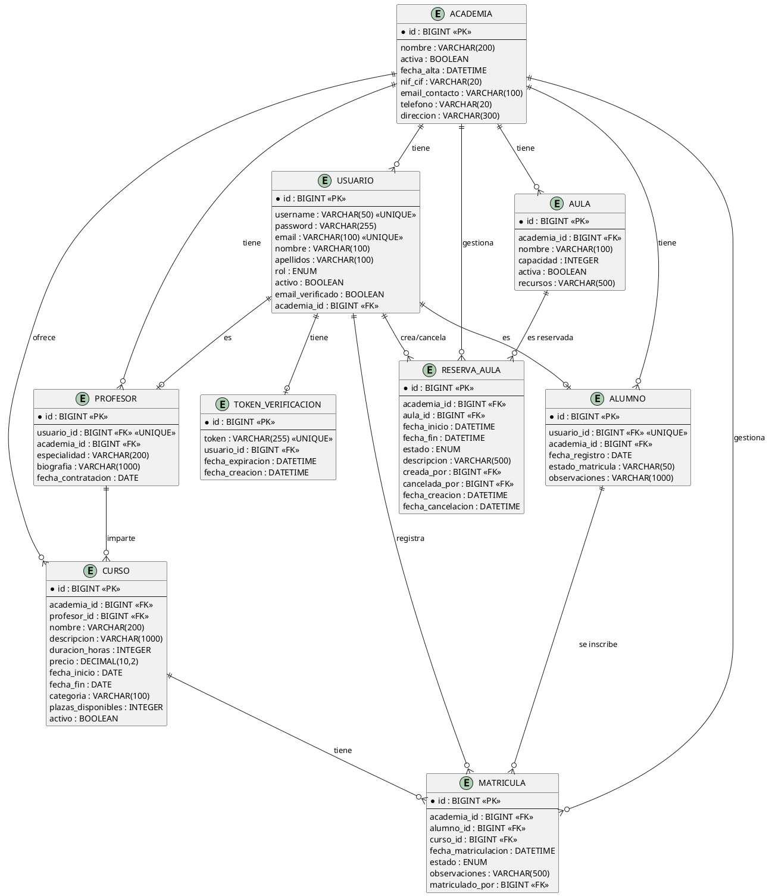

# Diagrama Entidad-Relación (ER) - Gestor de Academias

## Descripción General
Este diagrama representa la estructura de la base de datos del sistema de Gestión de Academias, mostrando las entidades, sus atributos, claves primarias, claves foráneas y las relaciones entre ellas con sus cardinalidades.

## Entidades

### 1. ACADEMIA
Representa las academias registradas en el sistema.

**Atributos:**
- `id` (PK) - BIGINT - Identificador único
- `nombre` - VARCHAR(200) NOT NULL - Nombre de la academia
- `activa` - BOOLEAN NOT NULL DEFAULT true - Estado de la academia
- `fecha_alta` - DATETIME NOT NULL - Fecha de registro
- `nif_cif` - VARCHAR(20) - Número de identificación fiscal
- `email_contacto` - VARCHAR(100) - Email de contacto
- `telefono` - VARCHAR(20) - Teléfono de contacto
- `direccion` - VARCHAR(300) - Dirección física

**Índices:**
- PRIMARY KEY (id)

---

### 2. USUARIO
Representa los usuarios del sistema con diferentes roles.

**Atributos:**
- `id` (PK) - BIGINT - Identificador único
- `username` - VARCHAR(50) NOT NULL UNIQUE - Nombre de usuario
- `password` - VARCHAR(255) NOT NULL - Contraseña cifrada
- `email` - VARCHAR(100) NOT NULL UNIQUE - Correo electrónico
- `nombre` - VARCHAR(100) - Nombre del usuario
- `apellidos` - VARCHAR(100) - Apellidos del usuario
- `rol` - ENUM('ADMIN', 'PROPIETARIO', 'SECRETARIA', 'PROFESOR', 'ALUMNO') NOT NULL - Rol del usuario
- `activo` - BOOLEAN NOT NULL DEFAULT true - Estado del usuario
- `email_verificado` - BOOLEAN NOT NULL DEFAULT false - Verificación de email
- `academia_id` (FK) - BIGINT - Academia a la que pertenece (nullable para ADMIN)

**Índices:**
- PRIMARY KEY (id)
- UNIQUE (username)
- UNIQUE (email)
- FOREIGN KEY (academia_id) REFERENCES academia(id)

---

### 3. TOKEN_VERIFICACION
Almacena los tokens de verificación de email.

**Atributos:**
- `id` (PK) - BIGINT - Identificador único
- `token` - VARCHAR(255) NOT NULL UNIQUE - Token de verificación
- `usuario_id` (FK) - BIGINT NOT NULL - Usuario asociado
- `fecha_expiracion` - DATETIME NOT NULL - Fecha de expiración
- `fecha_creacion` - DATETIME NOT NULL - Fecha de creación

**Índices:**
- PRIMARY KEY (id)
- UNIQUE (token)
- FOREIGN KEY (usuario_id) REFERENCES usuario(id)

---

### 4. PROFESOR
Representa los profesores que imparten cursos.

**Atributos:**
- `id` (PK) - BIGINT - Identificador único
- `usuario_id` (FK) - BIGINT NOT NULL UNIQUE - Usuario asociado
- `academia_id` (FK) - BIGINT NOT NULL - Academia a la que pertenece
- `especialidad` - VARCHAR(200) - Especialidad del profesor
- `biografia` - VARCHAR(1000) - Biografía profesional
- `fecha_contratacion` - DATE - Fecha de contratación

**Índices:**
- PRIMARY KEY (id)
- UNIQUE (usuario_id)
- FOREIGN KEY (usuario_id) REFERENCES usuario(id)
- FOREIGN KEY (academia_id) REFERENCES academia(id)

---

### 5. ALUMNO
Representa los alumnos registrados en las academias.

**Atributos:**
- `id` (PK) - BIGINT - Identificador único
- `usuario_id` (FK) - BIGINT NOT NULL UNIQUE - Usuario asociado
- `academia_id` (FK) - BIGINT NOT NULL - Academia a la que pertenece
- `fecha_registro` - DATE NOT NULL - Fecha de registro
- `estado_matricula` - VARCHAR(50) - Estado general (ACTIVO, INACTIVO, COMPLETADO, SUSPENDIDO)
- `observaciones` - VARCHAR(1000) - Observaciones adicionales

**Índices:**
- PRIMARY KEY (id)
- UNIQUE (usuario_id)
- FOREIGN KEY (usuario_id) REFERENCES usuario(id)
- FOREIGN KEY (academia_id) REFERENCES academia(id)

---

### 6. AULA
Representa las aulas disponibles en las academias.

**Atributos:**
- `id` (PK) - BIGINT - Identificador único
- `academia_id` (FK) - BIGINT NOT NULL - Academia a la que pertenece
- `nombre` - VARCHAR(100) NOT NULL - Nombre del aula
- `capacidad` - INTEGER NOT NULL - Capacidad de personas
- `activa` - BOOLEAN NOT NULL DEFAULT true - Estado del aula
- `recursos` - VARCHAR(500) - Recursos disponibles

**Índices:**
- PRIMARY KEY (id)
- INDEX idx_aula_academia (academia_id)
- INDEX idx_aula_academia_activa (academia_id, activa)
- FOREIGN KEY (academia_id) REFERENCES academia(id)

---

### 7. CURSO
Representa los cursos ofrecidos por las academias.

**Atributos:**
- `id` (PK) - BIGINT - Identificador único
- `academia_id` (FK) - BIGINT NOT NULL - Academia que ofrece el curso
- `profesor_id` (FK) - BIGINT NOT NULL - Profesor responsable
- `nombre` - VARCHAR(200) NOT NULL - Nombre del curso
- `descripcion` - VARCHAR(1000) - Descripción detallada
- `duracion_horas` - INTEGER NOT NULL - Duración en horas
- `precio` - DECIMAL(10,2) - Precio del curso
- `fecha_inicio` - DATE NOT NULL - Fecha de inicio
- `fecha_fin` - DATE NOT NULL - Fecha de finalización
- `categoria` - VARCHAR(100) - Categoría del curso
- `plazas_disponibles` - INTEGER - Número de plazas
- `activo` - BOOLEAN NOT NULL DEFAULT true - Estado del curso

**Índices:**
- PRIMARY KEY (id)
- INDEX idx_curso_academia (academia_id)
- INDEX idx_curso_profesor (profesor_id)
- INDEX idx_curso_fechas (fecha_inicio, fecha_fin)
- FOREIGN KEY (academia_id) REFERENCES academia(id)
- FOREIGN KEY (profesor_id) REFERENCES profesor(id)

---

### 8. MATRICULA
Representa las matrículas de alumnos en cursos.

**Atributos:**
- `id` (PK) - BIGINT - Identificador único
- `academia_id` (FK) - BIGINT NOT NULL - Academia
- `alumno_id` (FK) - BIGINT NOT NULL - Alumno matriculado
- `curso_id` (FK) - BIGINT NOT NULL - Curso
- `fecha_matriculacion` - DATETIME NOT NULL - Fecha de matrícula
- `estado` - ENUM('ACTIVA', 'COMPLETADA', 'CANCELADA') NOT NULL - Estado
- `observaciones` - VARCHAR(500) - Observaciones
- `matriculado_por` (FK) - BIGINT - Usuario que realizó la matrícula

**Índices:**
- PRIMARY KEY (id)
- INDEX idx_matricula_alumno (alumno_id)
- INDEX idx_matricula_curso (curso_id)
- INDEX idx_matricula_academia (academia_id)
- INDEX idx_matricula_estado (estado)
- FOREIGN KEY (academia_id) REFERENCES academia(id)
- FOREIGN KEY (alumno_id) REFERENCES alumno(id)
- FOREIGN KEY (curso_id) REFERENCES curso(id)
- FOREIGN KEY (matriculado_por) REFERENCES usuario(id)

---

### 9. RESERVA_AULA
Representa las reservas de aulas para eventos o clases.

**Atributos:**
- `id` (PK) - BIGINT - Identificador único
- `academia_id` (FK) - BIGINT NOT NULL - Academia
- `aula_id` (FK) - BIGINT NOT NULL - Aula reservada
- `fecha_inicio` - DATETIME NOT NULL - Fecha/hora de inicio
- `fecha_fin` - DATETIME NOT NULL - Fecha/hora de fin
- `estado` - ENUM('ACTIVA', 'CANCELADA') NOT NULL - Estado de la reserva
- `descripcion` - VARCHAR(500) - Descripción del evento
- `creada_por` (FK) - BIGINT NOT NULL - Usuario que creó la reserva
- `cancelada_por` (FK) - BIGINT - Usuario que canceló la reserva
- `fecha_creacion` - DATETIME NOT NULL - Fecha de creación
- `fecha_cancelacion` - DATETIME - Fecha de cancelación

**Índices:**
- PRIMARY KEY (id)
- INDEX idx_reserva_academia (academia_id)
- INDEX idx_reserva_aula (aula_id)
- INDEX idx_reserva_fechas (fecha_inicio, fecha_fin)
- INDEX idx_reserva_estado (estado)
- INDEX idx_reserva_aula_fechas (aula_id, fecha_inicio, fecha_fin, estado)
- FOREIGN KEY (academia_id) REFERENCES academia(id)
- FOREIGN KEY (aula_id) REFERENCES aula(id)
- FOREIGN KEY (creada_por) REFERENCES usuario(id)
- FOREIGN KEY (cancelada_por) REFERENCES usuario(id)

---

## Relaciones y Cardinalidades

### ACADEMIA ↔ USUARIO
- **Tipo:** One-to-Many (1:N)
- **Descripción:** Una academia puede tener muchos usuarios, un usuario pertenece a una academia (excepto ADMIN)
- **Cardinalidad:** Academia (1) ↔ (0..N) Usuario
- **Clave Foránea:** usuario.academia_id → academia.id
- **Restricción:** nullable para rol ADMIN

### USUARIO ↔ TOKEN_VERIFICACION
- **Tipo:** One-to-One (1:1)
- **Descripción:** Un usuario tiene un token de verificación
- **Cardinalidad:** Usuario (1) ↔ (0..1) TokenVerificacion
- **Clave Foránea:** token_verificacion.usuario_id → usuario.id

### USUARIO ↔ PROFESOR
- **Tipo:** One-to-One (1:1)
- **Descripción:** Un usuario con rol PROFESOR tiene un perfil de profesor
- **Cardinalidad:** Usuario (1) ↔ (0..1) Profesor
- **Clave Foránea:** profesor.usuario_id → usuario.id

### ACADEMIA ↔ PROFESOR
- **Tipo:** One-to-Many (1:N)
- **Descripción:** Una academia puede tener muchos profesores
- **Cardinalidad:** Academia (1) ↔ (0..N) Profesor
- **Clave Foránea:** profesor.academia_id → academia.id

### USUARIO ↔ ALUMNO
- **Tipo:** One-to-One (1:1)
- **Descripción:** Un usuario con rol ALUMNO tiene un perfil de alumno
- **Cardinalidad:** Usuario (1) ↔ (0..1) Alumno
- **Clave Foránea:** alumno.usuario_id → usuario.id

### ACADEMIA ↔ ALUMNO
- **Tipo:** One-to-Many (1:N)
- **Descripción:** Una academia puede tener muchos alumnos
- **Cardinalidad:** Academia (1) ↔ (0..N) Alumno
- **Clave Foránea:** alumno.academia_id → academia.id

### ACADEMIA ↔ AULA
- **Tipo:** One-to-Many (1:N)
- **Descripción:** Una academia puede tener muchas aulas
- **Cardinalidad:** Academia (1) ↔ (0..N) Aula
- **Clave Foránea:** aula.academia_id → academia.id

### ACADEMIA ↔ CURSO
- **Tipo:** One-to-Many (1:N)
- **Descripción:** Una academia puede ofrecer muchos cursos
- **Cardinalidad:** Academia (1) ↔ (0..N) Curso
- **Clave Foránea:** curso.academia_id → academia.id

### PROFESOR ↔ CURSO
- **Tipo:** One-to-Many (1:N)
- **Descripción:** Un profesor puede impartir muchos cursos
- **Cardinalidad:** Profesor (1) ↔ (0..N) Curso
- **Clave Foránea:** curso.profesor_id → profesor.id

### ALUMNO ↔ MATRICULA ↔ CURSO
- **Tipo:** Many-to-Many (N:M) a través de MATRICULA
- **Descripción:** Un alumno puede matricularse en muchos cursos y un curso puede tener muchos alumnos
- **Cardinalidad:** Alumno (1) ↔ (0..N) Matricula ↔ (0..N) Curso
- **Claves Foráneas:** 
  - matricula.alumno_id → alumno.id
  - matricula.curso_id → curso.id

### ACADEMIA ↔ MATRICULA
- **Tipo:** One-to-Many (1:N)
- **Descripción:** Una academia gestiona muchas matrículas
- **Cardinalidad:** Academia (1) ↔ (0..N) Matricula
- **Clave Foránea:** matricula.academia_id → academia.id

### USUARIO ↔ MATRICULA
- **Tipo:** One-to-Many (1:N)
- **Descripción:** Un usuario (secretaria) puede registrar muchas matrículas
- **Cardinalidad:** Usuario (1) ↔ (0..N) Matricula
- **Clave Foránea:** matricula.matriculado_por → usuario.id

### ACADEMIA ↔ RESERVA_AULA
- **Tipo:** One-to-Many (1:N)
- **Descripción:** Una academia puede tener muchas reservas
- **Cardinalidad:** Academia (1) ↔ (0..N) ReservaAula
- **Clave Foránea:** reserva_aula.academia_id → academia.id

### AULA ↔ RESERVA_AULA
- **Tipo:** One-to-Many (1:N)
- **Descripción:** Un aula puede tener muchas reservas
- **Cardinalidad:** Aula (1) ↔ (0..N) ReservaAula
- **Clave Foránea:** reserva_aula.aula_id → aula.id

### USUARIO ↔ RESERVA_AULA (creada_por)
- **Tipo:** One-to-Many (1:N)
- **Descripción:** Un usuario puede crear muchas reservas
- **Cardinalidad:** Usuario (1) ↔ (0..N) ReservaAula
- **Clave Foránea:** reserva_aula.creada_por → usuario.id

### USUARIO ↔ RESERVA_AULA (cancelada_por)
- **Tipo:** One-to-Many (1:N)
- **Descripción:** Un usuario puede cancelar muchas reservas
- **Cardinalidad:** Usuario (1) ↔ (0..N) ReservaAula
- **Clave Foránea:** reserva_aula.cancelada_por → usuario.id

---

## Diagrama Visual (Notación Chen/Crow's Foot)

```
                            ┌─────────────┐
                            │  ACADEMIA   │
                            ├─────────────┤
                            │ PK id       │
                            │    nombre   │
                            │    activa   │
                            │    ...      │
                            └─────────────┘
                                  │1
                   ┌──────────────┼──────────────┬────────────┬─────────┐
                   │N             │N             │N           │N        │N
              ┌────▼────┐    ┌───▼────┐    ┌───▼───┐   ┌────▼───┐  ┌──▼────────┐
              │ USUARIO │    │PROFESOR│    │ALUMNO │   │  AULA  │  │   CURSO   │
              ├─────────┤    ├────────┤    ├───────┤   ├────────┤  ├───────────┤
              │PK id    │    │PK id   │    │PK id  │   │PK id   │  │PK id      │
              │  ...    │    │FK usr_id│   │FK usr│   │FK acad│  │FK acad_id │
              │FK acad  │    │FK acad │    │FK acad│   │  ...   │  │FK prof_id │
              └────┬────┘    └───┬────┘    └───┬───┘   └────┬───┘  └─────┬─────┘
                1:1│1            │1:1          │1:1          │N          │N
                   └─────────────┘             │             │           │
                                               │N            │N          │N
                                          ┌────▼─────┐  ┌────▼────────┐ │
                                          │MATRICULA │  │RESERVA_AULA │ │
                                          ├──────────┤  ├─────────────┤ │
                                          │PK id     │  │PK id        │ │
                                          │FK alumno │◄─┼FK aula_id   │ │
                                          │FK curso  │  │FK creada_por│ │
                                          │FK acad   │  │FK cancel_por│ │
                                          │FK mat_por│  │FK acad_id   │ │
                                          └──────────┘  └─────────────┘ │
                                               │N                        │
                                               └─────────────────────────┘

              ┌──────────────────┐
              │TOKEN_VERIFICACION│
              ├──────────────────┤
              │PK id             │
              │FK usuario_id  1:1├──► USUARIO
              │   token          │
              │   ...            │
              └──────────────────┘
```

---

## Reglas de Negocio e Integridad

1. **Usuario y Academia:**
   - Los usuarios ADMIN pueden tener academia_id NULL
   - Todos los demás roles deben tener una academia asignada
   - Un usuario activo debe pertenecer a una academia activa (excepto ADMIN)

2. **Profesor y Alumno:**
   - Son extensiones de Usuario con rol específico
   - Relación 1:1 con Usuario
   - Deben pertenecer a la misma academia que su usuario

3. **Curso:**
   - Debe tener un profesor asignado
   - fecha_fin debe ser mayor que fecha_inicio
   - plazas_disponibles no puede ser negativo
   - Debe pertenecer a la misma academia que el profesor

4. **Matrícula:**
   - Un alumno no puede matricularse dos veces en el mismo curso
   - El curso debe estar activo para permitir nuevas matrículas
   - Estado ACTIVA por defecto al crear

5. **Reserva de Aula:**
   - fecha_fin debe ser mayor que fecha_inicio
   - No puede solaparse con otras reservas ACTIVAS de la misma aula
   - Estado ACTIVA por defecto al crear
   - Solo puede ser cancelada si está ACTIVA

6. **Token de Verificación:**
   - Un usuario solo puede tener un token válido a la vez
   - Expira después de 24 horas
   - Se elimina después de verificar el email

---

## Consideraciones de Diseño

### Normalización
El diseño está en **Tercera Forma Normal (3FN)**:
- Todos los atributos son atómicos
- No hay dependencias parciales
- No hay dependencias transitivas

### Índices
Se han definido índices estratégicos para:
- Búsquedas por academia (filtrado por contexto)
- Búsquedas por fechas (cursos, reservas)
- Búsquedas por estado (matrículas, reservas)
- Prevención de solapamiento de reservas

### Integridad Referencial
- Todas las relaciones tienen claves foráneas definidas
- Las eliminaciones deben ser manejadas en cascada o con restricciones según el caso de negocio
- Se recomienda borrado lógico (activo=false) en lugar de físico para mantener el histórico

### Escalabilidad
- Los índices compuestos optimizan consultas frecuentes
- La separación de entidades permite crecimiento independiente
- El uso de enums mejora la integridad y el rendimiento

---

## Modelo Visual Simplificado (PlantUML)



---

**Documento elaborado para el Hito 3 del proyecto Gestor de Academias**
*Fecha: Febrero 2026*
*Versión: 1.0*
